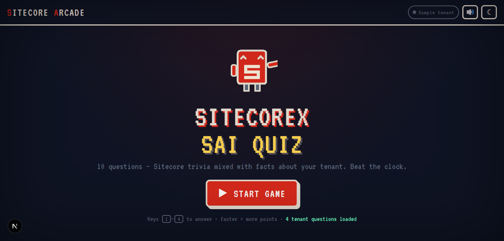
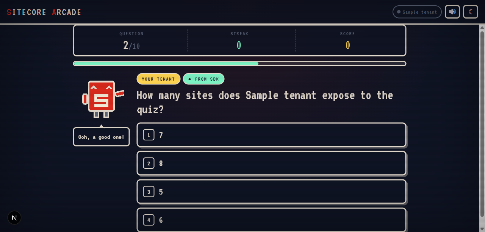
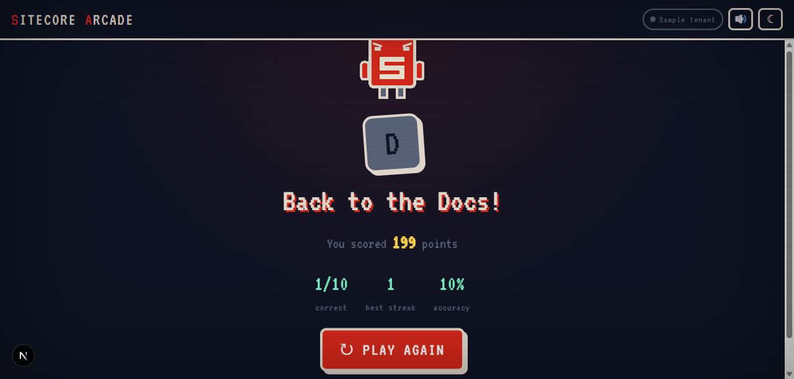

# Sitecorex SAI Quiz 🎮🛰️

A **Sitecore Arcade** trivia game that ships as a real **Marketplace SDK
full-page app**. It mixes curated Sitecore trivia with **live questions
generated from YOUR tenant** ("Which of your sites has the most pages?").
*Play with your tenant.*



## What makes it "SAI"

The **sai** = SitecoreAI / *your tenant*. When the game runs inside the Cloud
Portal, it reads real data over the Marketplace SDK postMessage bridge and turns
it into quiz questions. When it runs standalone (local dev), it uses bundled
**sample tenant** data so the game is always playable.

| | Standalone (local) | Embedded (Cloud Portal) |
|---|---|---|
| Tenant questions | Sample data | **Live** — your sites, page counts, languages |
| Top-right badge | `● Sample tenant` | `● Live: <tenant name>` |
| SDK connection | skipped (non-blocking) | `ClientSDK.init` + `xmc.agent.*` reads |



Each round is **4 tenant questions + 6 curated** = 10, shuffled. Faster answers
score more; streaks multiply (×1.5 / ×2 / ×3); grades run **D → S**.



## Run locally

```bash
cd site
npm install        # already run by the scaffold
npm run dev        # http://localhost:3210  (npx next dev -p 3210)
```

The game runs immediately on **sample data** — no tenant or portal needed.
Validate the toolchain with:

```bash
npm run typecheck && npm run lint && npm run build
```

All three pass clean (Next 16 / Turbopack, React 19, Tailwind v4).

## Connect a real tenant (operator step)

This is a **Mode A client-side** Marketplace app. To light up live data:

1. **Add Chrome Local Network Access headers** to `next.config.ts` before the
   first portal embed — copy the `headers()` block from the
   `sitecore:setup-marketplace-client-side` skill asset
   `next-config-pna-headers.mjs`. (HTTP localhost is fine for Mode A — no HTTPS
   needed.)
2. **Register a test app** in Cloud Portal → App Studio. Add a **Full screen**
   (or **Standalone**) extension point with the URL pointing at this app's root
   (`http://localhost:3210` for local, or the deployed origin).
3. Open the app from the portal. The badge flips to `● Live: <tenant>` and the
   tenant questions are generated from your real sites.

See `sitecore:marketplace-sdk-extension-routes` for the exact values to paste.

## Architecture

| File | Role |
|------|------|
| `app/page.tsx` | Full-page extension route → renders `<QuizGame>` |
| `app/layout.tsx` | Fonts (VT323 pixel + Geist) + global styles. **No** blocking provider. |
| `components/game/QuizGame.tsx` | The engine — state machine, timer, scoring, streaks, keyboard |
| `components/game/Mascot.tsx` | **Sitecorex** as a React/SVG component (moods: idle/host/happy/sad/think) |
| `lib/arcade/useOptionalMarketplace.ts` | **Non-blocking** SDK connect (the scaffold's provider blocks until portal-connected; this doesn't, so the game runs standalone) |
| `lib/arcade/tenant-source.ts` | The one place that touches the SDK — reads sites/pages, builds tenant questions, **falls back to sample data on any failure** |
| `lib/arcade/curated.ts` | Curated Sitecore-knowledge bank |
| `lib/arcade/audio.ts` | Web Audio SFX + the brand S-chime (no audio files) |
| `lib/arcade/arcade.css` | Pixel-arcade styling, scoped under `.arcade-root` so it can't fight the Blok/Tailwind globals |

### ⚠ Live-tenant path needs verification (rule 40-sdk-contracts)

`tenant-source.ts` reads `xmc.agent.sitesGetSitesList` / `sitesGetAllPagesBySite`
and unwraps the Mode A `result.data.data` envelope **defensively** — the exact
response field shapes are coded from the SDK catalog, not yet verified against
`node_modules/@sitecore-marketplace-sdk/xmc` `.d.ts` or a real tenant. Until that
verification happens the seam **degrades to sample data on any mismatch by
design**, so the game never breaks — but don't trust the live numbers until the
shapes are confirmed against a tenant.

## Brand

Part of the **Sitecore Arcade** family (`products/sitecore-arcade-brand/`) and
visually cohesive with its sibling `sitecore-arcade-quiz`: mascot **Sitecorex**,
red `#DA291C` / parchment / night palette, gold/mint accents, VT323 type, CRT
scanlines, and the 3-note S-chime. Dark default + light toggle.
